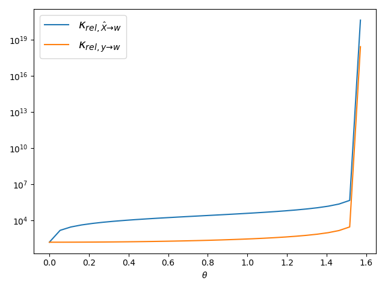

---
documentclass: IEEEtran
bibliography: bibliography.bib
header-includes: |
  \usepackage{amsthm}
  \usepackage{subfig}
  \usepackage{adjustbox}
...

\title{Analysis of optimization and numerical approaches to solve the linear least square problem}

\author{
\IEEEauthorblockN{
Emanuele Cosenza\IEEEauthorrefmark{1},
Riccardo Massidda\IEEEauthorrefmark{2}} \\
\vspace{2mm}
\IEEEauthorblockA{
Department of Computer Science \\
University of Pisa \\
\vspace{2mm}
\IEEEauthorrefmark{1}\,\href{mailto:e.cosenza3@studenti.unipi.it}{e.cosenza3@studenti.unipi.it},
\IEEEauthorrefmark{2}\,\href{mailto:r.massidda@studenti.unipi.it}{r.massidda@studenti.unipi.it}}}

\maketitle

\begin{abstract}
  The linear least square problem can be tackled using a wide range of optimization or numerical methods. The L-BFGS method of the class of limited-memory quasi-Newton algorithms has been chosen for the former, whilst the thin QR factorization with Householder reflectors for the latter. Both these algorithms have been implemented from scratch using Python language, to finally experiment over their performances in terms of precision, stability and speed. The accordance of the implementations with the underlying theoretical models is also studied and discussed.
\end{abstract}

<!-- Used to space tables -->
\renewcommand{\arraystretch}{1.5}

<!--
Setting the stage
=================

The first section of your report should contain a description of the problem and the methods that you plan to use.
This is intended just as a brief recall, to introduce some notation and specify which variants of the methods you are planning to use exactly.
Discuss the reasons behind the choices you make (the one you can make, that is, since several of them will be dictated by the statement of the project and cannot be questioned).
Your target audience should be someone who is already sufficiently familiar with the content of the course.
This is not the place to show your knowledge and repeat a large part of the theory: we are sure that you all can do that, given enough time, books, slides, and internet bandwidth.
A more in-depth mathematical part is expected in the next stage.
In case adapting the algorithm to your problem requires some further mathematical derivation (example: developing an exact line search for your problem, when possible, or adapting an algorithm to deal more efficiently with the special structure of your problem), you are supposed to discuss it here with all the necessary mathematical detail.
You are advised to send us a version of this section by e-mail as soon as it is done, so that we can catch misunderstandings as soon as possible and minimize the amount of work wasted.
Note that we do not want to see code at this point: that would be premature to produce (for you) and unnecessarily complicated to read (for us).
-->

# Introduction
Given a dataset composed by a matrix $\hat{X} \in \mathbb{R}^{m \times n}$ with $m \geq n$ and a vector $y \in \mathbb{R}^m$, the solution of the linear least square (LLS) problem is the vector $w \in \mathbb{R}^n$ that fits best the data assuming a linear function between $\hat{X}$ and $y$. [@nocedal_numerical_2006 p. 50]
This can be formalized as the following minimization problem:

$$
w_* = \min_w \| \hat{\boldmath{X}} w - y \|_2^2
$$

The matrix $\hat{X}$ is actually composed in the following way:

$$
\hat{X} = \begin{bmatrix}X^T\\I\end{bmatrix}
$$

Where $X \in \mathbb{R}^{n \times k}$ is a tall thin matrix, thus $m = k + n$.
The LLS problem can be dealt both with iterative methods or with direct numerical methods.
One algorithm has been chosen for each of these fields to finally discuss their experimental results.

## L-BFGS
<!-- Breve descrizione del metodo L-BFGS, a che famiglia appartiene e come si distingue da BFGS -->
The Limited-memory BFGS, L-BFGS, is an iterative method of the quasi-Newton limited-memory class.
This method is a variation of the BFGS method, with which it shares the update rule.
At the $i+1$-th iteration the point is updated as follows:
$$
w_{i+1} = w_i - \alpha_i H_i \nabla f_i
$$

The smaller memory requirements of this variation are due to the fact that the Hessian approximation $H_i$ is stored implicitly, and built over a fixed number of vector pairs $\{s_j, y_j\}$ of the previous $t$ iterations and an initial matrix $H_i^0$. Where

$$
s_i = w_{i+1} - w_i, \quad y_i = \nabla f_{i+1} - \nabla f_i
$$
$$
V_i = I - \rho_i y_i s_i^T, \quad \rho_i = \frac{1}{y_k^T s_k}
$$

so that $H_i$ satisfies the following condition

$$
\begin{split}
H_i & = (V^T_{i-1} \dots V^T_{i-t}) H_i^0 (V_{i-t} \dots V_{i-1}) \\
& + \rho_{i-t}(V^T_{i-1} \dots V^T_{i-t}+1) s_{i-t} s^T_{i-m} (V_{i-t+1} \dots V_{i-1}) \\
& + \rho_{i-t+1}(V^T_{i-1} \dots V^T_{i-t}+2) s_{i-t+1} s^T_{i-t+1} (V_{i-t+2} \dots V_{i-1}) \\
& + \dots \\
& + \rho_{i-1}s_{i-1}s_{i-1}^T \\
\end{split}
$$

Different strategies to initialize the $H_i^0$ matrix are proposed in the literature, and so they will be tested experimentally.
Finally, the step size $\alpha_i$ is found by performing an inexact line search based on the Armijo-Wolfe conditions.

## Thin QR factorization
For the numerical counterpart, the thin QR factorization with Householder reflectors has been implemented as described in [@trefethen_numerical_1997].

By using the Householder QR factorization, the matrix $R \in \mathbb{R}^{m \times n}$ is constructed in place of $\hat{X}$ and the $n$ reflection vectors $v_1, \dots, v_n$ are stored.
The reduced matrix $\hat{R} \in \mathbb{R}^{n \times n}$ is trivially obtainable by slicing as in $\hat{R} = R_{1:n,1:n}$, noting that constructing directly the reduced matrix would yield no significant advantage since we are already using $O(mn)$ space to store the reflection vectors.

By using the Householder vectors it is also possible to implicitly compute $\hat{Q}^Ty$ to finally obtain $w_*$ by back substitution over the upper-triangular system $\hat{R}w = \hat{Q}^T y$.

# Algorithmic analysis
<!--
What to expect from the algorithm(s)
====================================
Next, we expect a brief recall of the algorithmic properties that you expect to see in the experiments. Is the algorithm
(if it is iterative) guaranteed to converge? Is it going to be stable and return a good approximation of the solution
(if it is direct)? What is its complexity? Are there any relevant convergence results? Are the hypotheses of these
convergence results (convexity, compactness, differentiability, etc.) satisfied by your problem? If not, what are the
“closest” possible results you have available, and why exactly they are not applicable? Do you expect this to be
relevant in practice?
Again, you are advised to send us a version of this section by e-mail as soon as it is done. Again, we do not want
to see code at this point.
-->

## Convergence of L-BFGS

@liu_limited_1989 define three necessary assumptions to prove that the L-BFGS algorithm globally converges and that there exists a constant $0\leq r <1$ such that

$$
f(w_i) - f(w_*) \leq r^i (f(w_0) - f(w_*))
$$

so that the sequence $\{w_i\}$ converges R-linearly.

Firstly the objective function $f$ should be twice continuously differentiable.
Given the formulation of the least squares problem this is immediately true, the gradient and the Hessian of the objective function are definable as in:

$$
\nabla f(w) = \hat{X}^T ( \hat{X} w - y ) \\
$$

$$
\nabla^2 f(w) = \hat{X}^T \hat{X}
$$

Moreover the Hessian can be proven to be positive definite, as can be easily seen by rearranging it in the following way:

$$
\begin{split}
\nabla^2 f(w) & = \hat{X}^T \hat{X}  \\
& = \begin{vmatrix}X I\end{vmatrix} \begin{vmatrix}X^T \\ I\end{vmatrix} \\
& = XX^T + I
\end{split}
$$

The matrix $XX^T$ is positive semi-definite, since $\forall z : z^T X X^T z = \|X^T z \| \geq 0$, therefore all the eigenvalues of the matrix are non-negative.
Furthermore, according to the spectral theorem, since $XX^T$ is symmetric, there exists $U$ orthogonal matrix and $D$ diagonal containing the eigenvalues of $XX^T$.

$$
\begin{split}
\nabla^2 f(x) & = XX^T + I \\
& = UDU^T + I \\
& = UDU^T + UIU^T \\
& = U(D + I)U^T
\end{split}
$$

The eigenvalues of the Hessian are contained in $D+I$ and all of them are positive, therefore $\nabla^2 f(w)$ is positive definite.

Being the Hessian positive definite, the objective function $f$ is a convex function.
This comes in handy for the second assumption requiring the sublevel set $D=\{w \in \mathbb{R}^n | f(w) \leq f(w_0)\}$ to be convex.
It can be easily proved that if a function is convex all of its sublevel sets are convex sets.

$$
\begin{split}
\forall x,y \in D, \lambda \in [0,1] \\
& \textrm{f convex} \\
& \implies f(\lambda x + (1-\lambda)y) \\
& \leq \lambda f(x) + (1-\lambda) f(y) \\
& \leq \lambda f(w_0) + (1-\lambda) f(w_0) \\
& = f(w_0) \\
& \implies \lambda x + (1-\lambda) y \in D
\end{split}
$$

The third and last assumption requires the existence of two positive constants $M_1$ and $M_2$ such that $\forall z \in \mathbb{R}^n , w \in D$:

$$
M_1 \|z\|^2 \leq z^T \nabla^2 f(w) z \leq M_2 \|z\|^2
$$

or equivalently

$$
M_1 I \preceq \nabla^2 f(w) \preceq M_2 I
$$

Since $\nabla^2 f(w)$ is positive definite the previous condition is true for $M_1 = \lambda_{min}$ and $M_2 = \lambda_{max}$, where $\lambda_{min} > 0$.

In the convergence proof the $M_2$ constant is used to upper bound the trace of the next Hessian substitute $H_{i+1}$, implying an upper bound for the largest eigenvalue in the sequence of Hessian substitutes.

$$
tr(H_{i+1}) \leq tr(H_i^0) + t M_2 \leq M_3
$$

On the other hand the $M_1$ constant is used, to lower bound the determinant of $H_{i+1}$, implying a lower bound for the smallest eigenvalue in the sequence of Hessian substitutes.

$$
det(H_{i+1}) \geq det(H_i^0) + (\frac{M_1}{M_3})^t \geq M_4
$$

These two assertions are used to prove the existence of constant $\delta>0$ such that

$$
\forall i : \cos \theta_i = \frac{s_i^T H_i s_i}{\| s_i \| \|H_i s_i \|} \geq \delta
$$

where $\theta_i$ is the angle between the chosen direction and $- \nabla f (w_i)$.
<!-- Il dubbio fondamentale è sulla costante M_1, ossia l'autovalore minimo: potrebbe essere 0? Se si, questo è un problema? -->
If the constant $M_1$ was to be equal to zero, it would not be enough to prove the existence of $\delta > 0$ for each step, possibly having directions orthogonal to steepest one.
As already pointed out, given that the Hessian is positive definite, its eigenvalues and consequently $M_1$ are positive.

Other then the three discussed assumptions, the theorem requires for the sequence of initializers $\{\|H^0_i\|\}$ to be bounded.
This obviously depends on the initialization technique used to generate $H^0_i$, various techniques are suggested in the literature such as $H^0_k = \gamma_k I$ or $H^0_k = \gamma_k H_0$ where

$$
\gamma_k = \frac{s_{k-1}^T y_{k-1}}{\|y_{k-1}\|^2}
$$

Other initialization techniques may possibly be tested and evaluated experimentally.

## Armijo-Wolfe line search
The convergence proof requires the algorithm to perform a line search respectful of the Armijo-Wolfe conditions.
By defining the function $\phi$, used to evaluate the value of $f$ at a certain step-size $\alpha$, the conditions can be defined as follows.

$$
\phi ( \alpha ) = f ( w_i + \alpha d_i )
\end{equation*}
\begin{equation*}
\tag{A}
\label{eqn:armijo}
\phi(\alpha) \leq \phi(0) + \alpha \rho \phi ' (0)
\end{equation*}
\begin{equation*}
\tag{W}
\label{eqn:wolfe}
\phi ' (\alpha) \geq \sigma \phi ' (0)
$$

Given the quadratic nature of the least squares problem, it is possible to compute the exact optimal step-size $\bar\alpha$ by solving $\phi ' (\alpha) = 0$.
To simplify the following discussion the objective function $f(w)$ is described in the form $\frac{1}{2} w^TQw+q^Tw+c$ where

$$
Q=\hat X \hat X^T, q^T = -y^T\hat X, c=-\frac{1}{2}\|y\|^2
$$

Therefore the function $\phi ' (\alpha)$ can be defined as follows

$$
\phi ' (\alpha) = \frac{\partial f(w+\alpha d)}{\partial \alpha} = \nabla f(w)^T d + \alpha d^T Q d
$$

where $d$ is the descent direction computed by the L-BFGS algorithm.
The optimal step-size is then computable as

$$
\bar\alpha = - \frac{\nabla f(w)^T d}{d^TQd}
$$

It can be proven that the step size $\bar\alpha$ satisfies both \eqref{eqn:armijo} for any $\rho \leq \frac{1}{2}$ and \eqref{eqn:wolfe} for any positive $\sigma$. The core steps of the proofs are hereby reported, it should be remarked that these depend on the fact that $d$ is a descent direction, and so that $f(w)^Td<0$. \newline

### Armijo satisfaction proof

$$
\begin{split}
\phi(\bar\alpha) & \leq \phi(0) + \rho\bar\alpha\phi ' (0) \\
f(w + \bar\alpha d) - f(w) & \leq \rho\bar\alpha\nabla f(w)^Td \\
\bar\alpha (w^TQ + q^T)d + \frac{\bar\alpha^2}{2} d^TQd + & \leq \rho\bar\alpha\nabla f(w)^Td \\
\nabla f(w)^Td + \frac{\bar\alpha}{2} d^TQd + & \leq \rho\nabla f(w)^Td \\
\nabla f(w)^Td - \frac{1}{2} \frac{\nabla f(w)^Td}{d^TQd} d^TQd + & \leq \rho\nabla f(w)^Td \\
\rho & \leq \frac{1}{2} \\
\end{split}
$$

### Wolfe satisfaction proof

$$
\begin{split}
\phi ' (\alpha) & \geq \sigma \phi ' (0) \\
\nabla f(w)^T d + \bar\alpha d^TQd & \geq \sigma\nabla f(w)^T d \\
\nabla f(w)^T d - \nabla f(w)^T d & \geq \sigma\nabla f(w)^T d \\
\sigma & \geq 0\\
\end{split}
$$

## Analysis of standard and modified thin QR

Ignoring constants, we know from theory that the standard QR factorization algorithm applied on the matrix $\hat{X}$ yields a time complexity of $O(mn^2)$. Actually, given that we are generally dealing with a very tall and thin matrix $X$, the resulting $\hat{X}$ is going to be squarish ($m \approx n$). This means that we can consider the complexity to be cubic in $n$.

From now on, we show a way to bring down the time complexity of the algorithm from $O(mn^2)$ to $O(kn^2)$, with $k=m-n$. The resulting modified QR factorization algorithm will become useful when $k$ is much smaller than $m$, as in our case.\
In the standard algorithm, at each step we focus on a single column of the input matrix, constructing a householder vector to zero out all the entries below the diagonal. Following the geometric reasoning in [@trefethen_numerical_1997], this brings the algorithm to depend on $m$. While this cannot be avoided in general, in our particular case we can be a little bit smarter.

Since the block matrix $\hat{X}$ contains the identity as its lower block, at each step of the algorithm we can just focus on zeroing out the $k=m-n$ entries below the diagonal up to the 1s of the identity. In the modified algorithm then, to obtain $R$, the matrix $\hat{X}$ is multiplied on the left side by a sequence of matrices $L_i \in \mathbb{R}^{m \times m}$ of the form ($i=1,\dots,n$):

$$
L_i=
\begin{bmatrix}
I_{i-1} & 0 & 0\\
0 & H_i & 0\\
0 & 0 & I_{n-i}
\end{bmatrix}
$$

where $H_i \in \mathbb{R}^{(k+1) \times (k+1)}$ are all Householder reflectors that zero out the $k$ entries in the $i$-th column of the matrix which is being multiplied by $L_i$. The resulting Householder vectors will all have constant dimension $k+1$ and storing them will require $\theta(kn)$ space instead of $O(mn)$.\
To derive the time complexity of this phase we can reason as follows. The right side matrix can be divided in three blocks as in $\big[\begin{smallmatrix}
  A \\ B \\ C
\end{smallmatrix}\big]$. When we multiply this matrix by $L_i$ the only relevant operation is the matrix multiplication $H_i B$, which costs $O(kn)$. Since the total number of multiplications is $n$, the total complexity is $O(kn^2)$.\
Since each $L_i$ is orthogonal and symmetric it is then possible to reconstruct $Q$ and the reduced $\hat{Q}$ in the following way:

$$
\begin{array}{c}
Q = L_1 L_2 \dots L_n\\
\hat{Q} = L_1 L_2 \dots L_n
\begin{bmatrix}
I_n\\
0
\end{bmatrix}
\end{array}
$$

Applying again the reasoning above, the time complexity of these reconstructions is $O(kn^2)$. It follows that the overall time complexity of the modified QR factorization is $O(kn^2)$.

The least squares problem is then solved through back substitution over the upper-triangular system $\hat{R}w = \hat{Q}^T y$. Since the costs for the $\hat{Q}^T y$ product and the back substitution are dominated by the factorization cost, the overall time complexity for solving the least squares problem through QR factorization is $O(mn^2)$ when using the standard algorithm and $O(kn^2)$ when using the modified one.

## Stability and accuracy of the QR algorithm
As stated in [@trefethen_numerical_1997, 140], the algorithm obtained by combining the standard QR algorithm, the $Q^Ty$ product and back substitution is backward stable in the context of least squares problems.\
We claim that the QR factorization step remains backward stable if we consider the modified version described in this report. Without going into details with an extended proof, this can be explained by saying that at each step of the algorithm we apply a transformation $L_i$ doing a smaller number of operations than those of the standard algorithm. Then, since we know that each step of the standard QR factorization is backward stable, this must be true also in the modified version of the algorithm.

Considering that both versions of the QR algorithm are backward stable, the accuracy of the algorithms will depend mostly on the conditioning of the least squares problem at hand. In fact, following from the definition of backward stability, the algorithms will both find exact solutions to slightly perturbed problems, with perturbations of the order of machine precision. This implies that if the conditioning of the problem is high the real solutions to the perturbed problems are inevitably going to be inaccurate.\
If $w_*$ is the exact solution to the least squares problem and $\tilde{w}_*$ is the solution found with one of the QR based algorithms outlined above, the accuracy of the algorithms will therefore follow the general upper bounds of relative errors found in [@trefethen_numerical_1997, 131]: one relative to perturbations of the matrix $\hat{X}$,

$$
\frac{\| \tilde{w}_* - w_*\|}{\| w_* \|} \leq (\kappa(\hat{X}) + \kappa(\hat{X})^2 \tan \theta) \frac{\| \delta \hat{X} \|}{\| \hat{X} \|}
$$

and one relative to perturbations of the vector $y$,

$$
\frac{\| \tilde{w}_* - w_*\|}{\| w_* \|} \leq \left( \frac{\kappa(\hat{X})}{\cos \theta} \right) \frac{\| \delta y \|}{\| y \|}
$$

where $\theta$ is the angle such that $\cos \theta = \frac{\| \hat{X}w_* \|}{\| y \|}$.\
From these upper bounds we can expect that the algorithm will be more accurate when the angle $\theta$ is near 0 and less accurate when it is near $\frac{\pi}{2}$, reminding that in our context the value of $\theta$ will depend on the value of the random vector $y$.

<!-- In our context, the matrix xhat is not so ill-conditioned given that its condition number k(xhat) is 1.58*10^2 (k(A) has been found by computing sigma1/sigman through an SVD procedure).
Since the matrix X_hat is fixed, the only other way to vary the upperbounds is to vary the random vector y. In particular, if the angle theta between y and xhat*w is near 0 the upperbounds become *, on the other hand, if theta is near 90° the accuracies of the algorithms will degrade (especially because of the quadratic term in k(A)). -->

<!-- $$
\begin{bmatrix}
I_{n-1} & 0\\
0 & H_n\\
\end{bmatrix}
\begin{bmatrix}
I_{n-2} & 0 & 0\\
0 & H_{n-1} & 0\\
0 & 0 & I_1
\end{bmatrix}
\dots
\begin{bmatrix}
I_1 & 0 & 0\\
0 & H_2 & 0\\
0 & 0 & I_{n-2}
\end{bmatrix}
\begin{bmatrix}
H_1 & 0\\
0 & I_{n-1}
\end{bmatrix}
$$ -->

# Input data
<!--
What is your input data
=======================
Next, we expect a brief description of the data you will test your algorithms on. For “ML projects” this will typcally
be provided by the ML course, but still a modicum of descripton is required. For “no-ML projects”, it will typically
have to be either generated randomly, or picked up from the Internet, or a combination of both. This is not necessarily
a trivial process, as, say, random generation should ensure that “interesting” properties of the data (what kind of
solution can be expected, how well or ill-conditioned the problem is, . . . ) is properly controlled by the parameters of
the random generator. These aspects should be thoroughly described in the report.
Again, you are advised to send us a version of this section by e-mail as soon as it is done. Again, we do not want
to see code (unless seeing how instances is generated is much simpler by looking at a short well-commented code than
at a long winding report).
-->
Because of the bottom $I$ block, the input matrix $\hat{X}$ has $n$ linearly independent rows and consequently full column rank.
Therefore, a unique solution is expected from the linear least squares problem regardless of the possible values $y$.
Nonetheless, as discussed in the previous section, the conditioning of the problem is dependent on $y$, precisely on the angle $\theta$ between the image of $\hat{X}$ and $y$. (Figure \ref{conditioning})

The problem of extracting a random vector $y$ is tackled in two different ways, choosing one or the other depending on the specific experiment.
The first way is to extract $m$ random variables using a normal distribution, constructing so the $y$ vector by associating each component to a random variable. This is done by using the Numpy method `random.randn`.

When more control over the conditioning of the problem is instead required, the vector $y$ is extracted considering the $\theta$ angle as a constraint.
Firstly a vector $v$ perpendicular to the image is required, this can be done by selecting one of the columns of $Q_2$, from the $QR$ factorization of $\hat{X}$.
It is in fact immediate that for each $v$ column of $Q_2$ and for each $w \in \mathbb{R}^n$

$$
v^T \hat{X} w = v^T Q_1 R_1 w = 0
$$

since $v$ is orthogonal in respect to each column of $Q_1$ and different to each of them.
This procedure isn't part of the experimental evaluation, therefore the QR factorizer from the Numpy library has been used during this step.
By selecting a vector $w \in \mathbb{R}^n$, extracted using multiple normal random variables as previously discussed, it is necessary to constrain the norm of $v$ as in

$$
\| v \| = \| \hat{X}w \| \tan\theta
$$

The desired vector $y$ it is finally obtainable by summing $\hat{X}w + v$.

# Experimental results
The implemented techniques have been thoroughly evaluated against themselves and against the NumPy built-in method to solve the linear least squares problem.

$\dots$

Many of the described tests report the average of multiple runs, this is aimed to ensure the reproducibility of the experimental results, especially when random behavior plays a role.
The number of runs per experiment is fixed, moreover they are executed sequentially to avoid with certainty the effect of parallelization overhead.

For what concerns the optimization techniques, the different tunable parameters are discussed in each experiment when relevant.
Default conditions of the L-BFGS algorithm are reported in table \ref{table:lbfgs_init}.

\begin{table}[h]
  \centering
  \caption{Default parameter for the L-BFGS optimizer.}
  \label{table:lbfgs_init}
  \begin{adjustbox}{min width=0.3\textwidth}
  \begin{tabular}{lr}
    Parameter & \\
  \hline
    Memory & 8 \\
    Gradient threshold  & $1\mathrm{e}{-6}$ \\
    Max step & 2048 \\
    Initialization & $\gamma$ \\
  \end{tabular}
  \end{adjustbox}
\end{table}

For the following experiments, only the behavior of the modified version $QR*$ has been studied.
A comparison between the performances of standard $QR$ and $QR*$ is reported in table \ref{table:qr_comparison}.

\begin{table}[h]
  \centering
  \caption{Average results over multiple runs with normal random extracted $y$}
  \label{table:qr_comparison}
  \begin{adjustbox}{min width=0.3\textwidth}
  \begin{tabular}{lrr}
  \hline
  Model   &     Time &   Residual \\
  \hline
  Numpy QR &  1.07022 &    18.5621 \\
  QR*      &  1.63437 &    18.5621 \\
  QR       & 33.0972  &    18.5621 \\
  \end{tabular}
  \end{adjustbox}
\end{table}

## Conditioning effects

The angle $\theta$ between the image of $\hat{X}$ and the vector $y$ has a great impact on the conditioning of the problem.
The average behavior of the different methods against the $\theta$ value has been plotted in figure \ref{fig:theta}.
Figure \ref{fig:theta_residual} highlights how all the evaluated methods have almost overlapping curves for what concerns the residual of the problem, whilst showing a significant difference for the times in figure \ref{fig:theta_time}.
It is evident both in figures \ref{fig:theta_time} and \ref{fig:theta_steps} that as the conditioning of the problem worsen the more affected method is the L-BFGS, that isn't able to converge within the limit of the maximum steps allowed.

\begin{figure}[h]
  \centering
  \subfloat[][Residual in log-scale]{\includegraphics[width=0.5\textwidth]{assets/theta_residual.png}\label{fig:theta_residual}}
  \qquad
  \subfloat[][Execution time in seconds, lin-scale]{\includegraphics[width=0.5\textwidth]{assets/theta_time.png}\label{fig:theta_time}}
  \qquad
  \subfloat[][Steps for convergence, log-scale]{\includegraphics[width=0.5\textwidth]{assets/theta_steps.png}\label{fig:theta_steps}}
  \caption{Average residual (\ref{fig:theta_residual}), execution time (\ref{fig:theta_time}) and steps (\ref{fig:theta_steps}) for $\theta \in (0, \frac{\pi}{2})$}
  \label{fig:theta}
\end{figure}

The same metrics have been studied away from the extreme regions of $\theta$ for what concerns the conditioning.
Therefore the average results in the interval $\theta \in (\frac{\pi}{8}, \frac{3\pi}{8})$, also introducing the standard Newton method in the comparison, are reported in table \ref{table:theta_narrow}.
As seen in figure \ref{fig:theta_narrow_time} in such interval the execution time is constant for each method.

\begin{table}[h]
  \centering
  \caption{Comparison of different metrics obtained by averaging the results of multiple runs for $y$ such that $\theta \in (\frac{\pi}{8}, \frac{3\pi}{8})$.}
  \label{table:theta_narrow}
  \begin{adjustbox}{min width=0.4\textwidth}
  \begin{tabular}{lrrr}
  Model     &      Time &   Residual &   Steps \\
  \hline
  LLS Numpy & 1.7487    &    37186.1 &  1      \\
  Newton    & 0.0304131 &    37186.1 &  1      \\
  LBFGS     & 0.0819783 &    37186.1 & 11.2143 \\
  QR Numpy  & 1.10429   &    37186.1 &  1      \\
  QR*       & 1.2718    &    37186.1 &  1      \\
  \end{tabular}
  \end{adjustbox}
\end{table}

\begin{figure}[h]
  \centering
  \includegraphics[width=0.5\textwidth]{assets/theta_narrow_time.png}
  \caption{Average execution time in for the LLS problem for $\theta\in (\frac{\pi}{8},\frac{3\pi}{8})$}
  \label{fig:theta_narrow_time}
\end{figure}

## Initialization L-BFGS

Two different initialization techniques have been tested for the L-BFGS algorithm, precisely the use of $H^0_i = I$ and $H^0_i = \gamma_i I$.
To offer further insights, the BFGS algorithm has been implemented using $H_0 = I$.
Table \ref{table:sample_run} shows how the three variants converge exactly in the same way.
It is interesting that the use of $I$ to initialize both L-BFGS and BFGS results in the same sequence of step-size $\{\alpha_i\}$.
Regardless of the chosen initialization technique, L-BFGS converges $r$-linearly as expected. (Figure \ref{fig:LBFGS_r})

\begin{table}[t]
  \caption{Sample run of L-BFGS initialized with $I$, $\gamma I$ and BFGS initialized with $I$.}
  \label{table:sample_run}
  \centering\begin{adjustbox}{min width=0.4\textwidth}
  \begin{tabular}{l|ccc}
    \multicolumn{1}{c}{} & \multicolumn{3}{c}{$\gamma$ L-BFGS} \\
    Step & $\alpha$ & $\nabla f(w)$ & $f(w)$ \\
    \hline
    0 & 4.2441e-05 & 4.1504e+03 & 1.0367e+04 \\
    1 & 4.6988e+00 & 1.7129e+03 & 7.1077e+03 \\
    2 & 5.8083e+00 & 6.3167e+02 & 4.3524e+03 \\
    3 & 2.2707e+00 & 3.8537e+02 & 3.6034e+03 \\
    4 & 4.1725e-01 & 7.4976e+01 & 3.5187e+03 \\
    5 & 1.1454e+01 & 1.0631e+02 & 3.4832e+03 \\
    6 & 1.0217e+01 & 2.8971e+02 & 3.2416e+03 \\
    7 & 1.1427e+01 & 5.0177e+02 & 8.0810e+02 \\
    8 & 4.3134e-01 & 6.544e+01 & 2.0872e+01 \\
    9 & 8.81e-01 & 1.0072e+01 & 9.2727e+00 \\
    10 & 9.5111e-01 & 5.3348e-07 & 9.0174e+00 \\
    \hline
  \end{tabular}
  \end{adjustbox}
  \newline
  \vspace*{0.5 cm}
  \newline
  \begin{adjustbox}{min width=0.4\textwidth}
  \begin{tabular}{l|ccc}
    \multicolumn{1}{c}{} & \multicolumn{3}{c}{$I$ L-BFGS} \\
    Step & $\alpha$ & $\nabla f(w)$ & $f(w)$ \\
    \hline
    0 & 4.2441e-05 & 4.1504e+03 & 1.0367e+04 \\
    1 & 1.8922e-04 & 1.7129e+03 & 7.1077e+03 \\
    2 & 9.3913e-04 & 6.3167e+02 & 4.3524e+03 \\
    3 & 1.8772e-03 & 3.8537e+02 & 3.6034e+03 \\
    4 & 5.7079e-04 & 7.4976e+01 & 3.5187e+03 \\
    5 & 6.2994e-03 & 1.0631e+02 & 3.4832e+03 \\
    6 & 2.1379e-02 & 2.8971e+02 & 3.2416e+03 \\
    7 & 2.8993e-02 & 5.0177e+02 & 8.0810e+02 \\
    8 & 3.1267e-03 & 6.544e+01 & 2.0872e+01 \\
    9 & 2.7086e-03 & 1.0072e+01 & 9.2727e+00 \\
    10 & 2.5165e-03 & 5.3336e-07 & 9.0174e+00 \\
    \hline
  \end{tabular}
  \end{adjustbox}
  \newline
  \vspace*{0.5 cm}
  \newline
  \begin{adjustbox}{min width=0.4\textwidth}
  \begin{tabular}{l|ccc}
    \multicolumn{1}{c}{} & \multicolumn{3}{c}{$I$ BFGS} \\
    Step & $\alpha$ & $\nabla f(w)$ & $f(w)$ \\
    \hline
    0 & 4.2441e-05 & 4.1504e+03 & 1.0367e+04 \\
    1 & 1.8922e-04 & 1.7129e+03 & 7.1077e+03 \\
    2 & 9.3913e-04 & 6.3167e+02 & 4.3524e+03 \\
    3 & 1.8772e-03 & 3.8537e+02 & 3.6034e+03 \\
    4 & 5.7079e-04 & 7.4976e+01 & 3.5187e+03 \\
    5 & 6.2994e-03 & 1.0631e+02 & 3.4832e+03 \\
    6 & 2.1379e-02 & 2.8971e+02 & 3.2416e+03 \\
    7 & 2.8993e-02 & 5.0177e+02 & 8.0810e+02 \\
    8 & 3.1267e-03 & 6.544e+01 & 2.0872e+01 \\
    9 & 2.7086e-03 & 1.0072e+01 & 9.2727e+00 \\
    10 & 2.5165e-03 & 5.3245e-07 & 9.0174e+00 \\
  \end{tabular}
  \end{adjustbox}
\end{table}

\begin{figure}[h]
  \centering
  \subfloat[][log-scale]{\includegraphics[width=0.5\textwidth]{assets/LBFGS_r_log.png}\label{fig:LBFGS_r_log}}
  \qquad
  \subfloat[][lin-scale]{\includegraphics[width=0.5\textwidth]{assets/LBFGS_r_linear.png}\label{fig:LBFGS_r_linear}}
  \qquad
  \caption{Average convergence over multiple runs of the L-BFGS algorithm with $r \approx 0.737$}
  \label{fig:LBFGS_r}
\end{figure}

## Memory in L-BFGS

The L-BFGS algorithm has been tested for different values of memory $t \in (1,n)$, the average results of multiple runs are reported in figure \ref{fig:memory}.
Whilst the memory size had no impact on the residual (figure \ref{fig:memory_residual}), a significant reduction of the number of steps occurs even for minimal amounts of memory.
Anyhow the number of required steps quickly stabilizes, and it is not influenced by further memory increase.
Despite the noisy peaks in figure \ref{fig:memory_time}, it is evident how the increase of the memory has an increasing effect on the time required by the algorithm and consequently on the time per step.

\begin{figure}[h]
  \centering
  \subfloat[][Residual in lin-scale]{\includegraphics[width=0.5\textwidth]{assets/memory_residual.png}\label{fig:memory_residual}}
  \qquad
  \subfloat[][Execution time in seconds, lin-scale]{\includegraphics[width=0.5\textwidth]{assets/memory_time.png}\label{fig:memory_time}}
  \qquad
  \subfloat[][Steps for convergence, lin-scale]{\includegraphics[width=0.5\textwidth]{assets/memory_steps.png}\label{fig:memory_steps}}
  \caption{Average residual (\ref{fig:memory_residual}), execution time (\ref{fig:memory_time}) and steps (\ref{fig:memory_steps}) for L-BFGS with different memory $t \in (0,n)$}
  \label{fig:memory}
\end{figure}

# Conclusions

# Bibliography
