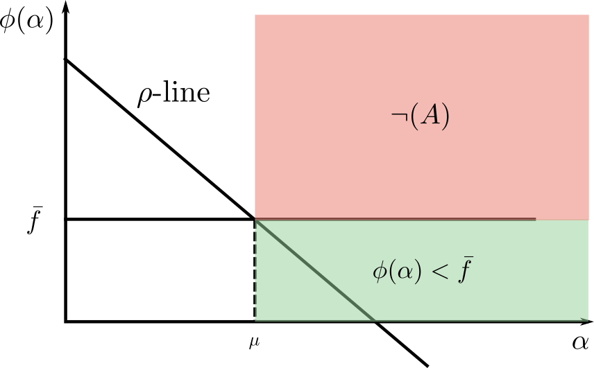

---
documentclass: IEEEtran
bibliography: bibliography.bib
...

\title{Analysis of optimization and numerical approaches to solve the linear least square problem}

\author{
\IEEEauthorblockN{
Emanuele Cosenza\IEEEauthorrefmark{1},
Riccardo Massidda\IEEEauthorrefmark{2}} \\
\vspace{2mm}
\IEEEauthorblockA{
Department of Computer Science \\
University of Pisa \\
\vspace{2mm}
\IEEEauthorrefmark{1}\,\href{mailto:e.cosenza3@studenti.unipi.it}{e.cosenza3@studenti.unipi.it},
\IEEEauthorrefmark{2}\,\href{mailto:r.massidda@studenti.unipi.it}{r.massidda@studenti.unipi.it}}}

\maketitle

\begin{abstract}
  The linear least square problem can be tackled using a wide range of optimization or numerical methods. The L-BFGS method of the class of limited-memory quasi-Newton algorithms has been chosen for the former, whilst the thin QR factorization with Householder reflectors for the latter. Both these algorithms have been implemented from scratch using Python language, to finally experiment over their performances in terms of precision, stability and speed. The accordance of the implementations with the underlying theoretical models is also studied and discussed.
\end{abstract}

<!--
Setting the stage
=================

The first section of your report should contain a description of the problem and the methods that you plan to use.
This is intended just as a brief recall, to introduce some notation and specify which variants of the methods you are planning to use exactly.
Discuss the reasons behind the choices you make (the one you can make, that is, since several of them will be dictated by the statement of the project and cannot be questioned).
Your target audience should be someone who is already sufficiently familiar with the content of the course.
This is not the place to show your knowledge and repeat a large part of the theory: we are sure that you all can do that, given enough time, books, slides, and internet bandwidth.
A more in-depth mathematical part is expected in the next stage.
In case adapting the algorithm to your problem requires some further mathematical derivation (example: developing an exact line search for your problem, when possible, or adapting an algorithm to deal more efficiently with the special structure of your problem), you are supposed to discuss it here with all the necessary mathematical detail.
You are advised to send us a version of this section by e-mail as soon as it is done, so that we can catch misunderstandings as soon as possible and minimize the amount of work wasted.
Note that we do not want to see code at this point: that would be premature to produce (for you) and unnecessarily complicated to read (for us).
-->

# Introduction
Given a dataset composed by a matrix $\hat{X} \in \mathbb{R}^{m \times n}$ with $m \geq n$ and a vector $y \in \mathbb{R}^m$, the solution of the linear least square (LLS) problem is the vector $w \in \mathbb{R}^n$ that fits best the data assuming a linear function between $\hat{X}$ and $y$. [@nocedal_numerical_2006 p. 50]
This can be formalized as the following minimization problem:

$$
w_* = \min_w \| \hat{\boldmath{X}} w - y \|_2^2
$$

The matrix $\hat{X}$ is actually composed in the following way:

$$
\hat{X} = \begin{bmatrix}X^T\\I\end{bmatrix}
$$

Where $X \in \mathbb{R}^{n \times k}$ is a tall thin matrix, thus $m = k + n$.
The LLS problem can be dealt both with iterative methods or with direct numerical methods.
One algorithm has been chosen for each of these fields to finally discuss their experimental results.

## L-BFGS
<!-- Breve descrizione del metodo L-BFGS, a che famiglia appartiene e come si distingue da BFGS -->
The Limited-memory BFGS, L-BFGS, is an iterative method of the quasi-Newton limited-memory class.
This method is a variation of the BFGS method, with which it shares the update rule.
At the $i+1$-th iteration the point is updated as follows:
$$
w_{i+1} = w_i - \alpha_i H_i \nabla f_i
$$

The smaller memory requirements of this variation are due to the fact that the Hessian approximation $H_i$ is stored implicitly, and built over a fixed number of vector pairs $\{s_j, y_j\}$ of the previous $t$ iterations and an initial matrix $H_i^0$. Where

$$
s_i = w_{i+1} - w_i, \quad y_i = \nabla f_{i+1} - \nabla f_i
$$
$$
V_i = I - \rho_i y_i s_i^T, \quad \rho_i = \frac{1}{y_k^T s_k}
$$

so that $H_i$ satisfies the following condition

$$
\begin{split}
H_i & = (V^T_{i-1} \dots V^T_{i-t}) H_i^0 (V_{i-t} \dots V_{i-1}) \\
& + \rho_{i-t}(V^T_{i-1} \dots V^T_{i-t}+1) s_{i-t} s^T_{i-m} (V_{i-t+1} \dots V_{i-1}) \\
& + \rho_{i-t+1}(V^T_{i-1} \dots V^T_{i-t}+2) s_{i-t+1} s^T_{i-t+1} (V_{i-t+2} \dots V_{i-1}) \\
& + \dots \\
& + \rho_{i-1}s_{i-1}s_{i-1}^T \\
\end{split}
$$

Different strategies to initialize the $H_i^0$ matrix are proposed in the literature, and so they will be tested experimentally.
Finally, the step size $\alpha_i$ is found by performing an inexact line search based on the Armijo-Wolfe conditions.

## Thin QR factorization
For the numerical counterpart, the thin QR factorization with Householder reflectors has been implemented as described in [@trefethen_numerical_1997].

By using the Householder QR factorization, the matrix $R$ is constructed in place of $\hat{X}$ and the $n$ reflection vectors $v_1, \dots, v_n$ are stored.
The reduced matrix $\hat{R}$ is trivially obtainable by slicing as in $\hat{R} = R_{1:n,1:n}$. In fact, given that $\hat{X}$ is already stored in memory and fully needed, there would be no advantage in directly constructing the reduced matrix.

By using the Householder vectors it is also possible to implicitly compute $\hat{Q}^Tb$ to finally obtain $w_*$ by back substitution over the upper-triangular system $\hat{R}w = \hat{Q}^T b$.

# Algorithmic analysis
<!--
What to expect from the algorithm(s)
====================================
Next, we expect a brief recall of the algorithmic properties that you expect to see in the experiments. Is the algorithm
(if it is iterative) guaranteed to converge? Is it going to be stable and return a good approximation of the solution
(if it is direct)? What is its complexity? Are there any relevant convergence results? Are the hypotheses of these
convergence results (convexity, compactness, differentiability, etc.) satisfied by your problem? If not, what are the
“closest” possible results you have available, and why exactly they are not applicable? Do you expect this to be
relevant in practice?
Again, you are advised to send us a version of this section by e-mail as soon as it is done. Again, we do not want
to see code at this point.
-->

## Convergence of L-BFGS

@liu_limited_1989 define three necessary assumptions to prove that the L-BFGS algorithm globally converges and that there exists a constant $0\leq r <1$ such that

$$
f(w_i) - f(w_*) \leq r^i (f(w_0) - f(w_*))
$$

so that the sequence $\{w_i\}$ converges R-linearly.

Firstly the objective function $f$ should be twice continuously differentiable.
Given the formulation of the least squares problem this is immediately true, the gradient and the Hessian of the objective function are definable as in:

$$
\nabla f(w) = \hat{X}^T ( \hat{X} w - y ) \\
$$

$$
\nabla^2 f(w) = \hat{X}^T \hat{X}
$$

Moreover the Hessian can be proven to be positive definite, as can be easily seen by rearranging it in the following way:

$$
\begin{split}
\nabla^2 f(w) & = \hat{X}^T \hat{X}  \\
& = \begin{vmatrix}X I\end{vmatrix} \begin{vmatrix}X^T \\ I\end{vmatrix} \\
& = XX^T + I
\end{split}
$$

The matrix $XX^T$ is positive semi-definite, since $\forall z : z^T X X^T z = \|X^T z \| \geq 0$, therefore all the eigenvalues of the matrix are non-negative.
Furthermore, according to the spectral theorem, since $XX^T$ is symmetric, there exists $U$ orthogonal matrix and $D$ diagonal containing the eigenvalues of $XX^T$.

$$
\begin{split}
\nabla^2 f(x) & = XX^T + I \\
& = UDU^T + I \\
& = UDU^T + UIU^T \\
& = U(D + I)U^T
\end{split}
$$

The eigenvalues of the Hessian are contained in $D+I$ and all of them are positive, therefore $\nabla^2 f(w)$ is positive definite.

Being the Hessian positive definite, the objective function $f$ is a convex function.
This comes in handy for the second assumption requiring the sublevel set $D=\{w \in \mathbb{R}^n | f(w) \leq f(w_0)\}$ to be convex.
It can be easily proved that if a function is convex all of its sublevel sets are convex sets.

$$
\begin{split}
\forall x,y \in D, \lambda \in [0,1] \\
& \textrm{f convex} \\
& \implies f(\lambda x + (1-\lambda)y) \\
& \leq \lambda f(x) + (1-\lambda) f(y) \\
& \leq \lambda f(w_0) + (1-\lambda) f(w_0) \\
& = f(w_0) \\
& \implies \lambda x + (1-\lambda) y \in D
\end{split}
$$

The third and last assumption requires the existence of two positive constants $M_1$ and $M_2$ such that $\forall z \in \mathbb{R}^n , w \in D$:

$$
M_1 \|z\|^2 \leq z^T \nabla^2 f(w) z \leq M_2 \|z\|^2
$$

or equivalently

$$
M_1 I \preceq \nabla^2 f(w) \preceq M_2 I
$$

Since $\nabla^2 f(w)$ is positive definite the previous condition is true for $M_1 = \lambda_{min}$ and $M_2 = \lambda_{max}$, where $\lambda_{min} > 0$.

In the convergence proof the $M_2$ constant is used to upper bound the trace of the next Hessian substitute $H_{i+1}$, implying an upper bound for the largest eigenvalue in the sequence of Hessian substitutes.

$$
tr(H_{i+1}) \leq tr(H_i^0) + t M_2 \leq M_3
$$

On the other hand the $M_1$ constant is used, to lower bound the determinant of $H_{i+1}$, implying a lower bound for the smallest eigenvalue in the sequence of Hessian substitutes.

$$
det(H_{i+1}) \geq det(H_i^0) + (\frac{M_1}{M_3})^t \geq M_4
$$

These two assertions are used to prove the existence of constant $\delta>0$ such that

$$
\forall i : \cos \theta_i = \frac{s_i^T H_i s_i}{\| s_i \| \|H_i s_i \|} \geq \delta
$$

where $\theta_i$ is the angle between the chosen direction and $- \nabla f (w_i)$.
<!-- Il dubbio fondamentale è sulla costante M_1, ossia l'autovalore minimo: potrebbe essere 0? Se si, questo è un problema? -->
If the constant $M_1$ was to be equal to zero, it would not be enough to prove the existence of $\delta > 0$ for each step, possibly having directions orthogonal to steepest one.
As already pointed out, given that the Hessian is positive definite, its eigenvalues and consequently $M_1$ are positive.

Other then the three discussed assumptions, the theorem requires for the sequence of initializers $\{\|H^0_i\|\}$ to be bounded.
This obviously depends on the initialization technique used to generate $H^0_i$, various techniques are suggested in the literature such as $H^0_k = \gamma_k I$ or $H^0_k = \gamma_k H_0$ where

$$
\gamma_k = \frac{s_{k-1}^T y_{k-1}}{\|y_{k-1}\|}
$$

Other initialization techniques may possibly be tested and evaluated experimentally.

## Armijo-Wolfe inexact line search
The convergence proof requires the algorithm to perform a line search respectful of the Armijo-Wolfe conditions, the solution described in @al-baali_efficient_1986 is therefore adapted and implemented.

The algorithm performs an inexact line search that is ensured to converge under the assumption that $\sigma > \rho$ where $\rho \in (0,\frac{1}{2}), \sigma \in (0,1)$, respectively the constant for the Armijo condition and for the Wolfe one.
By defining the function $\phi$, used to evaluate the value of $f$ at a certain step-size $\alpha$, the conditions can be defined as follows.

$$
\phi ( \alpha ) = f ( w_i + \alpha d_i )
\end{equation*}
\begin{equation*}
\tag{A}
\label{eqn:armijo}
\phi(\alpha) \leq \phi(0) + \alpha \rho \phi ' (0)
\end{equation*}
\begin{equation*}
\tag{W}
\label{eqn:wolfe}
\phi ' (\alpha) \geq \sigma \phi ' (0)
$$

<!-- Strong Wolfe Condition -->
<!-- $$ -->
<!-- | \phi ' (\alpha) | \leq - \sigma \phi ' (0) -->
<!-- $$ -->

The algorithm requires a lower bound $\bar f$ on $\phi(\alpha)$ for $\alpha \geq 0$. More precisely, it assumes that the user is prepared to accept any value of $\alpha$ for which $\phi(\alpha) \leq \bar f$ where $\bar f < \phi(0)$.
For the linear least-squares problem an obvious lower bound is $\bar f = 0$.

The algorithm performs an inexact line search by looking for a candidate point $\alpha_i$ at the $i$-th iteration in the interval $(a_i, b_i)$, stopping if such candidate reaches the lower bound or if it satisfies both \eqref{eqn:armijo} and \eqref{eqn:wolfe}.

The Armijo condition describes a line, called $\rho$-line, in the plot $(\alpha, \phi(\alpha))$ that can be useful to bound the starting interval.
In fact the initial search interval can be reduced from $(0,\infty)$ to $(0,\mu)$ where

$$
\mu = \frac{\bar f - \phi(0)}{\rho \phi ' (0)}
$$

It is immediate that $\forall \alpha > \mu$ either \eqref{eqn:armijo} can't be satisfied, or the point lies under the lower bound $\bar f$ (figure \ref{fig:mu}).

To proceed with the discussion over the shrinking procedure the function $T$ is defined as in

$$
T(a,b) = [a + \tau_1 (b-a), b - \tau_2 (b-a)]
$$

where $0 < \tau_1 \leq \tau_2 \leq \frac{1}{2}$.

If the candidate doesn't satisfy \eqref{eqn:armijo} or if the left extreme $a_i$ constitutes a better point, the next candidate is chosen in the interval $T(a_i, \alpha_i)$.
Otherwise if the candidate doesn't satisfies \eqref{eqn:wolfe} the next candidate is chosen in $T(\alpha_i, b_i)$.
In both cases the $a_{i+1}$ and $b_{i+1}$ are updated with the extremes returned by the $T$ function.

The candidate step-size may be randomly chosen between all the points in the interval defined by the $T$ function, this approach will be experimentally tested against quadratic interpolation. 

It should be noted that the @al-baali_efficient_1986 paper defines the function $T$ in a slightly different way, together with another function $E$ used to specifically define the interval when $\eqref{eqn:wolfe}$ is not satisfied.
The simplification hereby described is due to the fact that in our implementation it is ensured that $\forall i : a_i \leq \alpha_i \leq b_i \land b_i \neq \infty$, moreover this does not interfere with the convergence proof.

As suggested by @liu_limited_1989 the unitary step length should always be tried first, so the first candidate should be $\alpha_0 = 1$.
Other suggestions known in literature about the initialization of the remaining hyper-parameters are presented in the experimental setup section to be eventually evaluated.
<!-- The initial conditions are-->
<!-- $$-->
<!-- \alpha_0 = 1, a_0 = 0, b_0 = \mu, \tau_1 \approx 0.1, \tau_2 \approx 0.5, \sigma = 0.1, \rho = 0.01, \bar\alpha = 1-->
<!-- $$-->
<!-- 0, 1, 1. <!--Why?-1->-->

# Input data
<!--
What is your input data
=======================
Next, we expect a brief description of the data you will test your algorithms on. For “ML projects” this will typcally
be provided by the ML course, but still a modicum of descripton is required. For “no-ML projects”, it will typically
have to be either generated randomly, or picked up from the Internet, or a combination of both. This is not necessarily
a trivial process, as, say, random generation should ensure that “interesting” properties of the data (what kind of
solution can be expected, how well or ill-conditioned the problem is, . . . ) is properly controlled by the parameters of
the random generator. These aspects should be thoroughly described in the report.
Again, you are advised to send us a version of this section by e-mail as soon as it is done. Again, we do not want
to see code (unless seeing how instances is generated is much simpler by looking at a short well-commented code than
at a long winding report).
-->

# Implementation details

# Experimental results

# Conclusions

# Bibliography
